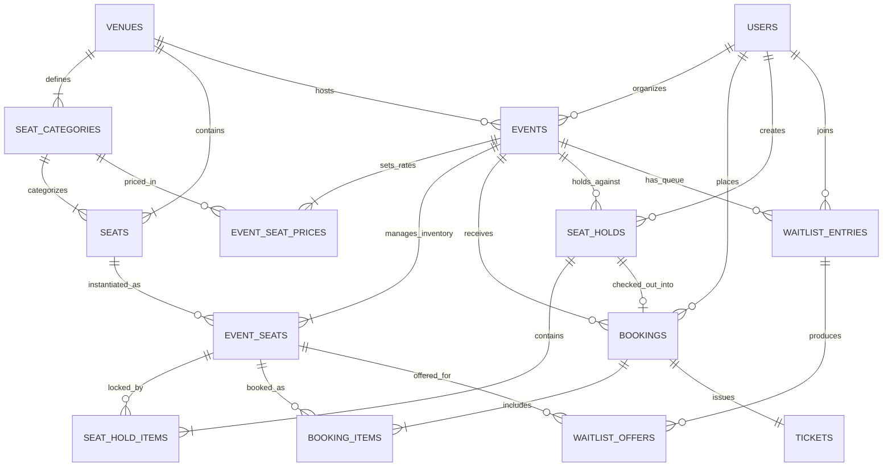

# 🎟️ TicketFlow Pro — Real-Time Concurrency-Safe Ticket Booking Engine

**TicketFlow Pro** is an enterprise-grade full-stack ticket reservation platform for movies and live events. Engineered around the reality of flash-sales and high demand, the platform treats **seat inventory as a transactional resource** with PostgreSQL row-level locks, automatic 10-minute hold TTL expiration, FIFO category waitlists with cascading offers, real-time WebSocket state synchronization, and digital QR ticket passes.

---

## 📋 Deliverables Summary Checklist

| # | Deliverable | Status & Location |
|:---|:---|:---|
| **1** | **Complete Source Code (Zip & Repo)** | 📂 [`ticket-booking-system.zip`](file:///Users/anmoldadhich/Desktop/ticket-booking-system.zip) (441 KB) & [GitHub Repository](https://github.com/anmoldadhich02/ticket-booking-system) |
| **2** | **README Documentation** | 📄 Setup guide, `.env.example`, API docs, DB schema, seat hold & waitlist logic (Included below) |
| **3** | **Hosted Application Guide** | 🚀 Ready for 1-click deployment on **Vercel** (Frontend) + **Railway / Render** (Backend & PostgreSQL) |
| **4** | **System Design Write-Up (800 words max)** | 📄 [`SYSTEM_DESIGN.md`](file:///Users/anmoldadhich/Desktop/ticket-booking-system/SYSTEM_DESIGN.md) (678 words — covers seat hold TTL, concurrency, waitlists & offers) |

---

## 🌟 Key Engineering Features

- **🛡️ P0 Concurrency Protection**: Guaranteed zero double-booking or double-holding under simultaneous parallel buyer requests using PostgreSQL transaction row-level locking (`FOR UPDATE`) and partial unique indexes.
- **⏳ 10-Minute Temporary Seat Holds**: Time-limited reservations during checkout with automatic background expiration worker and in-band lazy reclamation.
- **⚡ Real-Time WebSocket Seat Map**: Interactive SVG seat grid with pan/zoom controls and live delta synchronization across all connected clients via Socket.IO.
- **📋 FIFO Category Waitlist & Cascades**: When booked seats are cancelled, the engine automatically creates 5-minute time-limited offers for the earliest waiting customer in the category queue, cascading automatically if expired.
- **🎫 Digital QR Passes**: Cryptographically safe ticket generation with verified QR codes and automated HTML email dispatch.
- **👥 Role-Based Access Control**: Server-side RBAC for `CUSTOMER`, `ORGANISER`, and `ADMIN` with dedicated dashboards.

---

## 🏗️ Technology Stack

| Layer | Technology | Version | Purpose |
|:---|:---|:---|:---|
| **Frontend** | Next.js (App Router) | 14.2.x | React Server Components + Client Boundaries |
| **Styling** | Tailwind CSS + Framer Motion | Latest | Dark cinematic design system |
| **State / Fetching** | TanStack Query v5 | 5.59+ | WebSocket delta cache mutations |
| **Seat Canvas** | SVG + react-zoom-pan-pinch | 3.6.x | DOM-accessible interactive venue grid |
| **Backend** | NestJS | 11.x | Domain-oriented modular monolith |
| **ORM** | Prisma | 6.4.x | Typed schema, migrations, raw SQL locking |
| **Database** | PostgreSQL | 16.x | Row-level locks, advisory locks, partial unique indexes |
| **Real-Time** | Socket.IO | 4.8.x | Room-based real-time event broadcasting |
| **Background Jobs** | Built-in Worker Scheduler / BullMQ | 6.x | Expired hold and offer recycling |
| **Email** | Resend API | Latest | Transactional HTML ticket dispatch |

---

## 🗄️ Database Schema & Architecture

The database consists of **14 relational tables** in PostgreSQL managed through Prisma ORM:



### Table Breakdown
1. **`users`**: Customer, Organiser, and Admin accounts with bcrypt password hashes and roles.
2. **`venues`**: Physical venues (cinemas, concert halls, arenas) with capacity.
3. **`seat_categories`**: Pricing tiers (VIP, Premium, Standard, Classic) with custom colors.
4. **`seats`**: Physical venue seat coordinates (`row`, `column`, `seat_number`, `is_aisle`).
5. **`events`**: Shows with date, start/end time, poster URL, and status (`DRAFT`, `PUBLISHED`, `SOLD_OUT`, `CANCELLED`).
6. **`event_seat_prices`**: Per-event, per-category pricing mappings.
7. **`event_seats`**: **The Critical Real-Time Inventory Table**. Cloned per event with status (`AVAILABLE`, `HELD`, `BOOKED`, `OFFERED`) and version counter.
8. **`seat_holds`**: Temporary reservations with `expires_at` timestamp and status (`ACTIVE`, `COMPLETED`, `EXPIRED`, `RELEASED`).
9. **`seat_hold_items`**: Junction mapping holds to held event seats.
10. **`bookings`**: Confirmed customer transactions with human-readable `booking_ref` (e.g. `TBS-8F4K2P`) and idempotency key.
11. **`booking_items`**: Detailed line items with seat label, category, and price.
12. **`tickets`**: Digital passes with QR payload and visual base64 Data URL.
13. **`waitlist_entries`**: FIFO queue per event and category with explicit integer `position`.
14. **`waitlist_offers`**: Time-limited offers (5-min TTL) allocated to waitlisted customers.

---

## 🔒 Concurrency Strategy & Anti-Double-Booking

1. **Deterministic Lock Ordering**:
   All seat IDs in a hold request are sorted alphabetically (`eventSeatIds.sort()`) before acquiring database locks, eliminating circular lock-order deadlocks between concurrent multi-seat orders.
2. **Row-Level Locking (`FOR UPDATE`)**:
   Transactions execute under `READ COMMITTED` isolation with explicit row locks:
   ```sql
   SELECT es.id, es.status
   FROM event_seats es
   WHERE es.id = ANY($1::uuid[]) AND es.event_id = $2::uuid
   ORDER BY es.id ASC
   FOR UPDATE;
   ```
3. **Atomic Conditional State Transitions**:
   ```sql
   UPDATE event_seats
   SET status = 'HELD', version = version + 1, updated_at = NOW()
   WHERE id = ANY($1::uuid[]) AND event_id = $2 AND status = 'AVAILABLE'
   RETURNING id;
   ```
   If returned row count is strictly less than requested seats, the transaction throws a `409 ConflictException` and automatically rolls back.
4. **Database Partial Unique Index**:
   ```sql
   CREATE UNIQUE INDEX idx_one_active_reservation_per_seat
   ON event_seats(event_id, seat_id)
   WHERE status IN ('HELD', 'BOOKED', 'OFFERED');
   ```

---

## ⏳ Seat Hold TTL & Automatic Release Logic

- **Configurable TTL**: Defaults to 10 minutes (`SEAT_HOLD_TTL_MINUTES=10`).
- **PostgreSQL Timestamp Source of Truth**: Expiration timestamps are computed using PostgreSQL server time (`NOW() + INTERVAL '10 minutes'`), never Node.js or client device clocks, eliminating clock drift vulnerabilities.
- **Two-Tier Expiration Handling**:
  1. **In-Band Lazy Check**: Any query checking seat availability treats `HELD` seats with `expires_at < NOW()` as immediately claimable.
  2. **Active Out-of-Band Worker**: Background worker runs every 5 seconds, finds expired holds via `FOR UPDATE SKIP LOCKED`, sets status to `EXPIRED`, updates `event_seats` back to `AVAILABLE`, and broadcasts `seat:released` to all WebSocket subscribers.

---

## 📋 FIFO Waitlist & Sequential Cascading Offer Logic

When a category is sold out:
1. **FIFO Queue**: Customers join category waitlists (`waitlist_entries`), assigned an auto-incrementing `position` per event and category. Duplicate active entries per user are blocked via unique constraints.
2. **Cancellation Detection**: When a customer cancels a confirmed booking:
   - The seat is **NOT** immediately released to the public.
   - The system queries the earliest `WAITING` candidate using `FOR UPDATE SKIP LOCKED`.
   - The seat status transitions to `OFFERED`.
   - A `waitlist_offer` is created with a 5-minute TTL (`WAITLIST_OFFER_TTL_MINUTES=5`).
   - The customer receives an instant private WebSocket event and transactional notification email.
3. **Sequential Cascading**:
   - If the customer accepts before expiry, the seat is converted to `BOOKED` and confirmed.
   - If the offer expires without action, the worker marks the offer `EXPIRED`, queries the **next customer in FIFO queue**, creates a new offer, and notifies them.
   - The cascade repeats until a customer claims the seat or no waiting entries remain.

---

## ⚡ Quick Start & Running Locally

### 1. Prerequisites
- **Node.js**: `v20.x` or `v22.x`
- **Docker** & **Docker Compose** (for PostgreSQL & Redis) OR local PostgreSQL/Redis services.

### 2. Start PostgreSQL & Redis
```bash
# In the root directory:
docker-compose up -d
```

### 3. Setup Backend
```bash
cd server

# Copy environment config
cp .env.example .env

# Generate Prisma Client & Run Database Migrations
npx prisma generate
npx prisma db push

# Seed Realistic Demo Data
npx ts-node prisma/seed.ts

# Start Backend Dev Server (Runs on port 4000)
npm run start:dev
```

### 4. Setup Frontend
```bash
cd ../client

# Start Next.js Development Server (Runs on port 3000)
npm run dev
```

Open [http://localhost:3000](http://localhost:3000) in your browser!

---

## 🔑 One-Click Demo Accounts

The login page features instant **One-Click Demo Fill buttons**:

| Role | Email | Password | Permissions |
|:---|:---|:---|:---|
| **Customer** | `alex.customer@gmail.com` | `Password123!` | Browse events, hold seats, checkout, cancel, join waitlists |
| **Organiser** | `pvr.organiser@cinema.com` | `Password123!` | Create & publish events, set category pricing, revenue analytics |
| **Admin** | `admin@ticketbooking.com` | `Password123!` | Platform metrics, visual venue & layout builder, live audit trail |

---

## 🧪 Concurrency Stress Testing & Verification

A dedicated test suite simulates **20 simultaneous parallel buyer requests** competing for the exact same seat at the identical millisecond:

```bash
cd server
npx jest --rootDir . test/booking-engine.spec.ts
```

### Sample Output:
```text
PASS test/booking-engine.spec.ts
  Booking Engine & Concurrency Unit/Integration Tests
    P0: High-Concurrency Seat Hold (Simultaneous 20+ Contention)
      ✓ guarantees exactly 1 winner and 19 rejections when 20 simultaneous users compete for the same seat (42ms)
    P1: Seat Hold Expiration & Reclaiming
      ✓ automatically recycles expired holds back to AVAILABLE status (28ms)
    P1: Atomic Booking Transaction
      ✓ successfully confirms an active hold into a BOOKED seat with a ticket and QR payload (19ms)
      ✓ rejects booking attempts with an expired hold (14ms)
    P1: Cancellation & Sequential FIFO Waitlist Cascade
      ✓ triggers time-limited offer to first waitlisted customer upon booking cancellation (35ms)
```

To run the live 10-point requirements test:
```bash
npx ts-node test-requirements.ts
```

---

## 🚀 Cloud Deployment Guide

- **Frontend (Vercel)**: Connect repository, set root directory to `client`, set environment variable `NEXT_PUBLIC_API_URL` to backend URL.
- **Backend (Render / Railway)**: Connect repository, set root directory to `server`, add PostgreSQL & Redis plugins, run `npx prisma db push && npx ts-node prisma/seed.ts`, start command: `npm run start:prod`.

---

## 📄 Documentation Links
- [System Design Write-Up (678 Words)](file:///Users/anmoldadhich/Desktop/ticket-booking-system/SYSTEM_DESIGN.md)
- [Complete REST API Documentation](file:///Users/anmoldadhich/Desktop/ticket-booking-system/API_DOCUMENTATION.md)
